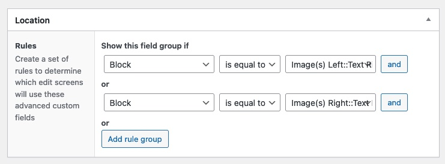
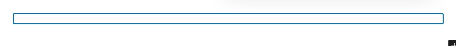
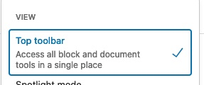
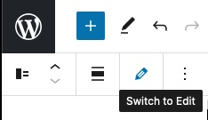
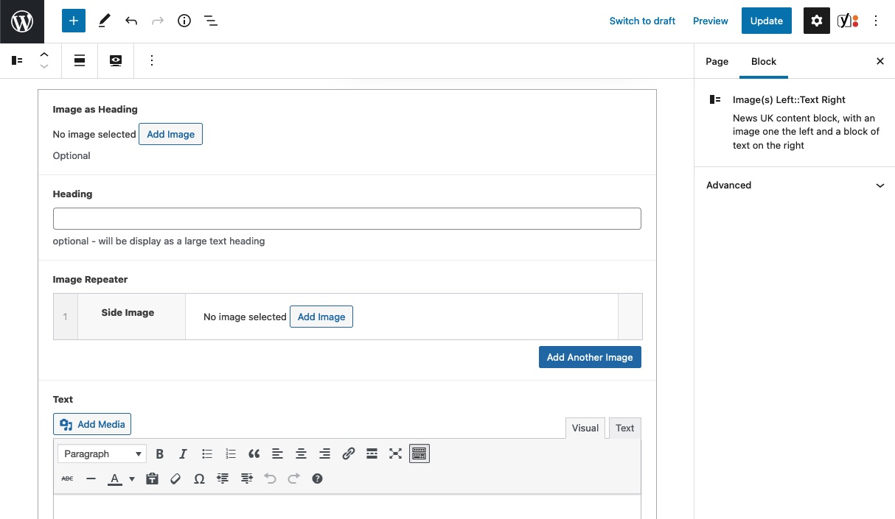
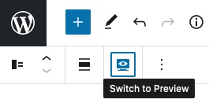

# WordPress Starter App
This project provides a basic starter app for WordPress projects.
The aim is to provide a baseline through select plugins that help to make WordPress nicer to work with / that we commonly install.

As WordPress is always being developed feel free to update this project to keep it in-step with the latest versions of WordPress.

### Current Versions 

* 3.0.0: PHP 8.0 | WP 6.0   - Bump starter kit to use WP 6 on PHP 8
See [CHANGELOG.md](./CHANGELOG.md) for more info


## Contents:
1. [Standard Plugins](#1-features-and-plugins)
2. [Installation & Setup](#2---install--usage)
3. [Config Vars](#3---config-vars-wp-config)
    3.1. The .env file
    3.2.Defining constants
4. [Theme Customisation and Settings](#4---theme-customisation-and-settings)
    4.1. Appearance Theme >> Customise
    4.2. ACF Theme Options Page(s)
5. [The DI Container and Custom Services](#5---the-di-container-and-registering-custom-services)
6. [ACF Field Groups & Theme Options](#6---acf-field-groups--theme-options)
    6.1. ACF JSON - All ACF is version controlled
    6.2. Theme Config Options
    6.3. ACF Blocks
7. [Custom Controllers & Routes](#7---custom-controllers-and-routes)
8. [Custom Post Types and Taxonomies](#8---custom-posttypes--taxonomies)
   8.1 Customise Admin Listings
9. [Basic WordPress Search](#9--basic-wordpress-search)
10. [Site Menus - Top Nav, Utility Nav, Footer Nav, Legals Nav](#10---site-menus)
11. [Assets - Loading CSS and JavaScript Files with versioned query params](#11---assets-loading-css-and-javascripts)
    11.1. SCSS Compiler and minification
    11.2. Enqueue Header, Footer and Admin
    11.3. Favicons
12. [Twig and Timber](#12---twig-and-timber)
    12.1. Template Folder Structure
    12.2. add dump function for local dev only
    12.3. addEnvFunction to get ENV vars
    12.4. make site wide options available to twig templates
    12.5. get current URL
    12.6. Pagination
13. [Session Management](#13---session-management)
14. [Language files for static labels](#14---language-files-for-static-labels)
15. [Breadcrumbs by Yoast](#15-breadcrumbs-by-yoast)
16. [Deployment with Capistrano](#16-deployment-with-capistrano)


## 1 Features and plugins
* PHP 7.4 || PHP 8+
* Capistrano
* Composer
    * [Bedrock](https://roots.io/bedrock/)
    * [Lumberjack](https://docs.lumberjack.rareloop.com/) | [docs](https://docs.lumberjack.rareloop.com/)
    * [Timber](https://www.upstatement.com/timber/) | [docs](https://timber.github.io/docs/)
    * [ACF Pro](https://www.advancedcustomfields.com/pro/)
    * [Yoast](https://en-gb.wordpress.org/plugins/wordpress-seo/)

* Standard Plugins
    * Contact Form 7
    * HTTP Security (Add CSP Security Rules)  (auto-disables on local dev by default - see `LOCALLY_DISABLED_PLUGINS` key in .env file to override)
    * iThemes Security (auto-disables on local dev by default - see `LOCALLY_DISABLED_PLUGINS` key in .env file to override)
    * Yoast SEO
    * WP Super Cache

* Dev Only Plugins
    * Debug Bar
    * Rewrite Rules Inspector
    * Show Current Template
    * Timber Debug Bar

* Must Use Plugins
    * ACF Pro
    * Bedrock Autoloader (by Roots )
    * Disallow Indexing (by Roots )
    * Register Theme Directory (by Roots )

* Mail reply_to and return_path being forced through code to prevent spam issues (set MAIL_RETURN_PATH_AND_REPLY_TO)
* Composer script to remove any default WordPress themes installed is preinstalled
* ASSETS Cache-busting on deploy so long as enqueue asset uses  `ASSETS_VERSION` constant as the version number

## 2 - Install / Usage
* **DOWNLOAD** this project, don't clone it.
* Run `cp .env.example .env` and configure your env file.
* Create a blank DB locally as named in your `.env` file
    * Populate Any and all blank vars - e.g. Google Maps API key
* Set a local URL in your hosts file
* Update `config/environments/development.php` and set the `$_SERVER['HTTP_HOST']` fallback value required for CLI tasks like composer and WP-CLI.
* Run composer install or update
* Configure capistrano (search for CHANGEME)
* Run local web server - php inbuilt server is enough. No real need for Docker / Vagrant.
    * A Jetbrains RunConfiguration is included.
* Install WordPress by visiting dev domain  e.g. `wordpress-starter.test:8000/wpwp-install`
* Activate plugin(s) in CMS
* Activate Custom Theme in CMS - our PostInstaller script will have deleted the default WP themes
* Create a new HOME (Front Page) page in `Appearance > Themes > Customise > Homepage Settings`
* Delete or move to Draft mode the "Sample Page"
* Set Permalinks to **Post Name** i.e. `/index.php/%postname%/` Activate Custom Theme in CMS - our PostInstaller script will have deleted the default WP themes

## 3 - Config Vars (wp-config)

### The .env file
Any sensitive information such as API Keys, Database paths or password etc. should be noted in et .nev file
This file is marked as a `shared` file in the capistrano deploy - such that it is shared across multiple deploys

Obviously the live  and staging environments will have different values than your local dev environment
These values can either be set by a deployment manager, server engineers or most commonly by creating a `.env.staging` and `.env.production` file with the appropriate per-server values in them

If you run the capistrano command `cap staging deploy:env` then capistrano will deploy the contents of the appropriate file
These files are not committed to git - and their contents should be copied to a KeePass record.

### Making your .env values available to your app
Most likely you'll define constants for these values. Normally in WordPress that would be done in the WP-Config.php file.
In the Bedrock build, you do not edit wp-config.php, instead any values you might normally set there should instead be set inside the `config/application.php` file.

This file already reads your `.env` file and sets all of those key-value pairs as environment vars accessible via `env('KEY_NAME')` , `getenv('KEY_NAME')` or the super-global `$_ENV['KEY_NAME']` array.

Any application level constants you wish to define should be defined there also.

##### Environment Specific Config

If you have any environment specific settings you want changed, e.g. dev environment should have `WP_DEBUG` set to true,
the place to set these values and constants is in the `config/environment/[environment_name].php` file.
There are environments for local development, staging and production.


## 4 - Theme Customisation and Settings

Appearance > Customise

Set Homepage to a `Static Page` from the list of Pages.
- create one if necessary.


## 5 - The DI Container and registering custom services
Build your own custom Services or utility classes in `[themefolder]/app/Services`
This is just your own custom class - that does whatever you need/want and does not necessarily depend on any WordPress/Rareloop/Timber classes

Once you have created, your Service class, you may want (optional) to register it within the Dependency Injection container.
To do this you will need to
a) Define the construction of your class in a Service Provider.
If your Service class is simple, you can just add a new line to the AppServiceProvider
If you need to define something more sophisticated, you can create your own ServiceProvider class in `app/Providers/` doing so you can inject other dependencies into your class.

b) If you created a new `Provider` then you need to add that to the `providers[]` block in `[themefolder]/app/config/app.php`

See: https://docs.lumberjack.rareloop.com/container/using-the-container
and: https://docs.lumberjack.rareloop.com/container/service-providers

## 6 - ACF Field Groups & Theme Options
Advanced Custom Fields is set as a Must-Use Plugin; Ensure you have the License Key defined in your `.env` file.

#### 6.1 ACF JSON
An acf-json folder exists inside the theme folder.
This is the only method you should use for moving changes to the live server. You should NEVER make any changes to ACF Group Fields on the live site.

See: https://www.advancedcustomfields.com/resources/synchronized-json/

#### 6.2 Theme Config Options
This kit comes with 4 pages of ACF Theme Config Settings.  
This is for storing variables that may be accessed across the entire site - e.g a contact phone number that would be output in the site footer.

You can edit the ACF Groups for these pages to add new fields; or indeed you can register new Theme option pages
The Option Pages are registered by the RegisterAssetsService(`[theme-folder]/app/Services/RegisterAssetsService.php`)

The options created are accessible in our twig templates with the `options` array e.g. `{{ options.contact_email }}`

#### 6.3 ACF Blocks
You can build out "Blocks" for WordPress Gutenberg using [ACF Blocks](https://www.advancedcustomfields.com/blog/acf-5-8-introducing-acf-blocks-for-gutenberg/).  
_**N.B.**_ Since ACF v6.0 Custom Blocks are defined in a JSON file. see [Upgrade legacy block to Block.json with ACF 6](https://www.advancedcustomfields.com/resources/how-to-upgrade-a-legacy-block-to-block-json-with-acf-6/) for more

To assist with this, there is an `AcfCustomBlockService` as well as  
an `AbstractAcfBlock` class, and `AcfBlockInterface`

This Kit contains an example "Block" called ImageLeftTextRight, which as the name suggest lets you create a block with  
a large image on the left and some text on the right.

###### 6.3.1 - define your custom ACF block
Create a simple AcfBlock class in the app/AcfBlocks folder/namespace  
Look at the example block for guidance.


###### 6.3.2 - register your Block
Blocks are registered in a similar manner to registering a custom post type.
Your custom block class, is simply listed in the `AcfCustomBlockService` constructor.

###### 6.3.3 - create the fields for your block in ACF

Create ACf fields as normal to support this block.
But instead for choosing e.g., a Page Template or Post type to decide when to use these fields - choose "Block"
And in the right-side drop-down selector, choose the block you registered in 6.3.2 above.



Save the ACF block definition in acf-json as normal.

###### 6.3.3 - displaying the block content
Create a Twig template for your block in `views/acf-blocks`
It works just like any other twig template
the ACF fields are available in the {{ fields }} var
there is a special {{ is_preview }} boolean that allows you to tweak the display for the gutenberg editor view
as opposed to your main site output view.

###### 6.3.4 Working with the editor

Initially, once you click the plus button and add the block, it is of course empty and simply appears as a blue outline   


To start adding content, it is recommended that you first use the Top Bar view, by clicking on the three-dots menu  


By default, the block editor fields are in et sidebar, which is cramped, if you  
then, click the pencil icon in the top toolbar, that will give you much more room.  


As shown


Once finished, toggle the icon from eyeball, back to pencil



Using ACF blocks like this can offer the power of the custom designs created for you with the flexibility
of ad-hoc layouts that remain within the style of that custom design.


## 7 - Custom Controllers and Routes

### WordPress Controllers
WordPress still looks for the standard naming convention files in the theme-folder root.
e.g. for a Jobs custom post type it looks for `single-job.php` or `archive-job.php`

However, you **must** name the class inside that file according to RareLoop Router conventions.
Using the same examples as above that would equate to:-  
`single-job.php` => `SingleJobController`  
`archive-job.php` => `ArchiveJobController`

### Custom Controllers
It is possible to bypass WordPress routing and controllers entirely and build your own custom Controllers

Build these inside `[theme-folder]/app/Http/Controllers` and extend `Rareloop\Lumberjack\Http\Controller` as `BaseController`

You can pass in any dependencies that are registered in the DI container via your __construct method

You can have one or more named methods in there that each service different url paths to provide different services, but in order to route the traffic to those methods, you need to register you controllers in the
`[theme-folder]/routes.php` file

e.g.
```php 
  Router::get('api/import', 'MyApiImportController@import');
```

This defines the `api/import` as the route for the `import` method on the `MyApiImportController` class

Read more about Routing here: https://docs.lumberjack.rareloop.com/the-basics/routing


## 8 - Custom PostTypes & Taxonomies

Define your custom post types inside `themefolder/app/PostType/MyPostType.php`  
Register posts types in `themefolder/posttypes.php`  
Controllers for a post type must contain a handle() method
e.g.  `themefolder/single-myposttype.php`


### Custom Taxonomies
Custom taxonomies are defined inside `themefolder/app/Taxonomy/MyTaxonomyType.php`
They are Registered using the same register PostTypes mechanism in `themefolder/posttypes.php`

in order to be registered, a custom taxonomy must have a public `register()` method
To make creation easier - extend the `App\Taxonomy\AbstractTaxonomy` which provide an interface and some base methods.

### 8.1 Customise Admin Listings

This Kit has a CustomPostTypesAdminService which will check the registered CPTs for the following methods.
- registerAdminColumns
- amendAdminSearchQuery

To register ACF fields as columns in the Admin listings for a Custom Post Type,
Your CustomPostType class should implement the method RegisterAdminColumns
That method is detected and fired off by the CustomPostTypesAdminService.

Typically, your registerAdminColumns method is quite simple, the hard work being done by
3 additional methods to actually assign and locate the correct data

```php
  //  app/PostTypes/[MyCustomPost]Type.php
  /**
  * @param $self
  */
  public static function registerAdminColumns($self) {
      // What columns do we want?
      add_filter ( 'manage_[CPT_SLUG]_posts_columns', [$self,'register_acf_columns'] );

      // What will they show
      add_action('manage_[CPT_SLUG]_posts_custom_column',  [$self,'add_acf_fields_as_admin_columns'], 10,2 );

      // Are they sortable - NB dash before CPT_SLUG here not an underscore
      add_filter('manage_edit-[CPT_SLUG]_sortable_columns',  [$self,'register_acf_field_as_sortable_admin_column'] );
  }
```

To add the columns then.
```php
    //  app/PostTypes/[MyCustomPost]Type.php
    /**
     * Register custom admin **column names**
     * @param $columns
     * @return array|string[]|void[]
     */
    public static function register_acf_columns ( $columns ): array
    {
        // First unset date - why? because we almost always want that as the last column
        $date = $columns['date'];
        unset( $columns['date'] );

        // Register any other ACF fields we want to display in our Admin
        return array_merge ( $columns, array (
            // 'wholesale_sku' => __ ( 'Wholesaler SKU Number' ),
            // 'manufacturer' => __( 'Manufacturer' ),
            // 'product_type' => __( 'Type' ),
            // etc
            'date' => $date // add date back at the end
        ) );
    }
```

That's just defining the columns but not telling it how to fetch that data for display

```php
//  app/PostTypes/[MyCustomPost]Type.php
    /**
     * Define custom column output
     * @param $column
     * @param $post_id
     */
    public static function add_acf_fields_as_admin_columns($column, $post_id): void
    {

        switch ( $column ) {
            case 'wholesale_sku':
                echo get_post_meta ( $post_id, 'v', true );
                break;
            case 'manufacturer':
                echo get_post_meta ( $post_id, 'manufacturer', true );
                break;
            case 'product_type':
                echo get_post_meta ( $post_id, 'product_type', true );
                break;
        }
    }
```

OPTIONAL
You may want some of your custom columns to be sortable
```php
    //  app/PostTypes/[MyCustomPost]Type.php 
    /**
     * Register an existing column as sortable
     * you MUST  register the actual column first though
     * @param $columns
     */
    public static function register_acf_field_as_sortable_admin_column($columns)
    {

        $columns['departments'] = 'nuk_department';

        //$columns['external_id'] = 'external_id';
        //$columns['primary_recruiter'] = 'primary_recruiter';

        return $columns;
    }
```

##### Amending the search query on the admin side
If you implement the static method `amendAdminSearchQuery` on your custom post type class
then this will be registered as a filter for admin side search.

The search on the admin side uses the post_title only; to allow you to search or check for Meta Fields as well
simply use the `AdminSearchableByMeta` trait.


Alternatively for more custom search support, look at that trait, so see what it does/how it works and implement your own
`CustomPostType::amendAdminSearchQuery` static method instead of using the trait.

## 9 - Basic WordPress Search
Out of the box, the WordPress search URL is `{homepage}/?s={search-query}`  

By Activating the `SearchResultsService` in the `AppServiceProvider`
You can have a real destination URL for eth search results page e.g. at `/search/{search-query}`

simply uncomment these lines to activate the service, then skin up your own search page templates to suit.
```php
// File: web/app/themes/smc/app/Providers/AppServiceProvider.php 
        ... Line 22
        // Uncomment/comment the next line to activate/deactive the custom search results page slug
        // $this->app->bind('SearchResultsService', 'App\Services\SearchResultsService');
        ...
```


If you nt to use a page url other than `/search/` you can amend that in eth `SearchResultsService` file.
```php
// File: web/app/themes/smc/app/Services/SearchResultsService.php

    /**
     * Change the search results page from WEBROOT/?s= to /search/search-query-terms
     */
    public function zsty_change_search_url() {

        if ( is_search() && ! empty( $_GET['s'] ) ) {
            // Set a custom URL for search results page here.
            wp_redirect( home_url( "/search/" ) . urlencode( get_query_var( 's' ) ) );
            exit();
        }
    }
```

## 10 - Site Menus
Most commonly a site would have 3 or 4 separate menus
- Utility Nav
- Main Nav
- Footer Nav
- Legals Nav

Register your menus in the Lumberjack config `[theme-folder]/config/menu.php`
These are then built/populated within the CMS,
And finally easily output within your templates using the built-in timber helpers

The `app/Http/Lumberjack.php` file will look for these registered menu locations and populate Menu objects
into the twig context for each of them.

See: https://timber.github.io/docs/guides/menus/

Using a custom fragment template that gives you more granular control over the markup
  ```twig
  
  ```


## 11 - Assets Loading CSS and JavaScripts
All the CSS and JS files are registered / enqueued to WordPress by a Custom Service, the `RegisterAssetsService`
That service is simply a class with functions for registering assets to the '<head>' or to the footer '</body>' areas of the page.
It also has methods for loading specific CSS or JS into the admin side, and also for the login screen.

The styles loaded by the registerLoginScreenStyles() method is how the login page is themed.

## 12 - Twig and Timber

Some useful Generic timber tips

{{ theme.link }} is the full URL to your theme folder  
useful for linking to static assets
 ```html
   {{ theme.link }}/assets/main/icons/favicon.ico
 ```

Other WordPress Functions  => Timber equivalents  
 
| WordPress Function             | Timber Way                               |
|--------------------------------|------------------------------------------|
| get_template_directory_uri()   | {{ theme.link }} _(Parent Themes)_       |
| get_template_directory_uri()   | {{ theme.parent.link }} _(Child Themes)_ |
| get_stylesheet_directory_uri() | {{ theme.link }}                         |
| get_template_directory()       | {{ theme.parent.path }}                  |
| get_stylesheet_directory()     | {{ theme.path }}                         |


#### 12.1 Template Folder Structure  

| Folder              | Purpose                                                                                                                      |
|---------------------|------------------------------------------------------------------------------------------------------------------------------|
| `./acf-blocks`      | Custom gutenberg blocks - not to be confused with twig blocks.                                                               |
| `./components`      | Repeating template blocks e.g an Info Card or pagination.      <br />_For Example:-_                                         |
|                     | - an Info Card                                                                                                               |                                                                                                            
|                     | - header                                                                                                                     |
|                     | - footer                                                                                                                     |
|                     | - Hero banner                                                                                                                |
|                     | - a search form                                                                                                              |
|                     | - a nav menu                                                                                                                 |
|                     | - newsletter signup form                                                                                                     |
|                     | - a standard carousel (might include info card                                                                               |
|                     | - pagination                                                                                                                 |
|                     |                                                                                                                              |
| `./components/base` | Outer containers for the site<br /> main opening and closing html and body<br />Examples                                     |
|                     | - html-header (the bit inside <head> tags )                                                                                  |                                                                                  
|                     | - header (visible webpage header with top nav / hero etc)                                                                    |                                                                    
|                     | - footer                                                                                                                     |
|                     |                                                                                                                              |
| `./fragments`       | Small snippets that repeat over and over such as a link                                                                      |
|                     |                                                                                                                              |
| `./templates`       | Main templates. 1 twig template for each distinct Wordpress-template or page type. each one of these should extend base.twig |
|                     | - front-page (or home)                                                                                                       | 
|                     | -archive-[post-type]                                                                                                         |
|                     | - page-[page-slug]                                                                                                           |
|                     | -single-[post-type]                                                                                                          |
|                     | -single-[post-type]                                                                                                          |
|                     | -search-results                                                                                                              |
|                     | -full                                                                                                                        |
|                     | -twenty-80                                                                                                                   |
|                     | -contact search-results /errors/404                                                                                          |
|                     | -search-results /errors/404                                                                                                  |
|                     | -/errors/404                                                                                                                 |


`views/acf-blocks`  - custom gutenberg blocks - not to be confused with twig blocks.
`views/components` - Repeating template blocks such as the hero.
`views/fragments` - Small snippets that repeat over and over such as a link.  
`views/templates` - The main page templates.


#### 12.2 dump function
This kit includes the symfony debug component and the hellonico/vardumper package for styling the dumped data in dev mode.
to use simply `{{ dump(varname) }}` in our template.

Look at the app/Services/ContextService for example of adding your own Twig Filters and functions.

#### 12.3 env Function
The context service has made the env() function available to your twig templates
 `{{ env(ENV_VARNAME) }}`

#### 12.4 Site Wide Options

#### 12.5 Get Current URL
the context service adds a get_current_url function to twig to easily allow you to us the current pages URL
e.g. for social sharing
 ```html 
  <a href="https://socialnetwork.com/share/?url={{ get_current_url()|url_encode }}"  target="_blank">
    <span class="hide">Share</span>
  </a>
 ```

#### 12.6 Pagination of listings / archives
Timber pagination can often throw a 404 error for page 2 of archive results

The fix for this is to specify the post_per_page (again) eve if you set it in your WP Query
The best way to ensure consistency, is to define the posts_per_page as a static variable in your CustomPostType class

 ```php 
  // ... /app/CustomPostYpe/[YourPostType].php
  
  /**
  * @var int
  */
  public static $perpage = 10;
 ```

Then set your rules in the TimberPaginationHelperService
And ensure this service has been "registered" in the `AppServiceProvider::register` method
And that it has been instantiated in the `AppServiceProvider:boot` method.

 ```php 
    // ..app/Services/TimberPaginationHelperService.php
    
    public function timberPaginationQuery( $query ) {
        // only fire this if it's the Main query - AND it's not an admin page
        if ( $query->is_main_query() && !is_admin() ) {

            // JOBS search Page
            if( is_post_type_archive('nuk_job')) {
                // If this is not set here the timber page reuslt in a 404 for /page/2 +
                $query->set('posts_per_page', Job::$perpage);
            }
            // Add more custom post type clauses below here
        }
    }
 ```


- [Twig Docs](https://twig.symfony.com/doc/3.x/)
- [Timber Docs](https://timber.github.io/docs/)

Timber is a WordPress plugin that allows the templates to be built with twig, thus segregating the backend PHP logic from the front end layout and display code.
You should refer to both the Twig official and Timber manuals when building twig templates.

The Timber Docs Guides section in particular is very useful.

## 13 - Session Management
By default, Lumberjack handles all PHP sessions in files, using the php.ini file location.
You can specify a specific file location using the .env VAR `SESSION_FILEPATH`

An alternative session driver has been added since version 2.4 of this package to support REDIS as a session store.
This is primarily used in 3-Server clusters where the LoadBalancer is used as the Session Manager.

In order to make use of the RedisSession Driver

13.1 Ensure the `REDIS_` vars are specified in the .env file
13.2 Ensure you have the [credis](https://github.com/colinmollenhour/credis) PHP library installed in composer.json
13.3 In `config/app.php` uncomment the Redis Session Provider

You should now be able to see session data being stored in Redis. You can easily confirm this by using the Redis-CLI tool.

## 14 - Language Files for static labels
Never output plain text as hardcoded - but instead use translation file labels.
This allows the theme to be translated at a later date if required.

Text output is internationalized with standard wordPress functions, wrapped in twig brackets

e.g. `{{ __(post.type,'app') }}` where `app` is the default text domain

All translation files for our 'app' text domain should be placed in from [theme-folder]/languages
and should be named simply according to language e.g. `fr_CA.po` with no prefixes


## 15 Breadcrumbs by Yoast

Yoast SEO has a built-in breadcrumbs generation feature
configurable at: `wp/wp-admin/admin.php?page=wpseo_titles#top#breadcrumbs`

called as e.g. `yoast_breadcrumb('<ul class="breadcrumbs "><li>','</li></ul>',true);`

You may want to create a custom twig fragment for the output of this.

If you find that there are issues with the breadcrumbs, quite often a simple `yoast index --reindex` will fix it.
Use WPCLI to run this command or use the Capsitrano `wpcli:yoast_reindex` task.

## 16 Deployment with Capistrano
[Capistrano](https://capistranorb.com/documentation/getting-started/) is a ruby based ssh task runner.  
You can use it to connect to remote servers over ssh and run scripted tasks. This how we semi-automate deployments.

The Capistrano dependencies should be defined in the Gemfile.     
Ruby 2.7.2 is the advised ruby version to use, `rbenv local 2.7.2`  
Go ahead and run `bundle install` to install the capistrano dependencies.

A Capistrano deployment is a scripted way of ssh to server and running git-pull.    
However, it does much more than that. For example, the git-pull and composer install are run in a new timestamp folder, ad only once completed successfully is the webroot symlink swapped to that new build version.

This means deployments are seamless with minimal to zero downtime, and in the event of a problem roll back is available to any previously deployed and available timestamped folder.

Follow the [installation instructions](https://capistranorb.com/documentation/getting-started/installation/) for Capistrano - you need only ever do this once.  
It's recommended that you use a tool like `rbenv` such that you can have different versions of ruby/cap per project

If you do use rbenv, then you'll need to set a ruby version for that local folder e.g. `rbenv local 2.7.2`

Look at the `Capfile` the `required` elements will need installed via gem. If any are missing from the Gemfile, you can install them yourself, but note that the slash ine the name is replaced with a dash in the installation package name.

e.g.  Capistrano/ssh-doctor is installed with the command `gem install capistrano-ssh-doctor`.

Once you have all the requirements in place you are ready to view the available Capistrano commands and to run your first deploy.

`Cap -T` will list all the capistrano commands, note there are several WordPress specific commands that hook into the WPCLI tool.

##### First deploy e.g. to staging server

**NB** - you MUST first have a public ssh key from the server, which needs to be added to your gitlab projects deploy keys.


```sh 
cap staging composer:install_executable
cap staging deploy:env
cap staging deploy:check
cap staging deploy
```

If for any reason the deployment fails, you will be presented with the last 20 lines of the process which should allow you to isolate the issue and correct it before running `cap deploy` again.

